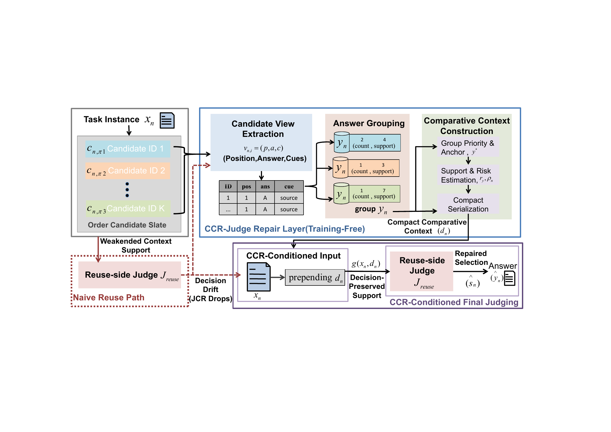

# CCR_JUDGE

Clean CCR/Ori-protocol and paper_repair experiment package.

This repository keeps the runnable CCR/Ori protocol code, fixed-slate
paper_repair code, and ablation scripts. Local experiment outputs, large
downloaded data, caches, and model/checkpoint artifacts are not part of the
uploadable source package.

## Framework

<p align="center">
  
</p>

<p align="center">
  <a href="assets/framework.pdf">View framework figure as PDF</a>
</p>

## Main Entry

```bash
cd CCR_JUDGE
./run_qwen_ori_protocol_progressive.sh \
  --datasets "mmlu humaneval gsm8k" \
  --gpu 0
```

Small bounded diagnostic run:

```bash
cd CCR_JUDGE
./run_qwen_ori_protocol_progressive.sh \
  --datasets "mmlu" \
  --gpu 0 \
  --limit-questions 3
```

This command still performs true model inference on the selected examples. Do
not use the default launcher command as a smoke test unless `--limit-questions`
is set to a small value and the selected split or index file is authorized for
the current phase.

## Included Paths

- `KVCOMM/`
- `experiments/`
- `dataset_adapters/`
- `paper_repair/`
- `ablation_study/`
- `my_datasets/`
- Ori protocol launchers:
  - `run_qwen_ori_protocol_progressive.sh`
  - `run_all_mmlu_ori_protocol.sh`
  - `run_all_humaneval.sh`
  - `run_all_gsm8k.sh`
  - `run_all_openbookqa_ori_protocol.sh`
  - `run_all_online_ori_protocol_extension_formal.sh`
- Paper/fixed-slate launchers:
  - `run_all_paper_repair_formal.sh`
  - `run_qwen_paper_repair_ac_full.sh`
  - `run_qwen_paper_repair_fixed.sh`
  - `run_paper_repair_judge_only_split_methods.sh`
  - `run_submission_table_metrics.sh`

## Data Notes

MMLU data is intentionally not committed. The code keeps
`my_datasets/MMLU/download.py`; the MMLU adapter calls the downloader when the
dataset is needed.

The generated/downloaded MMLU tree under `my_datasets/MMLU/data/` and the
archive `my_datasets/MMLU/data.tar` are local-only artifacts and should not be
checked in.

HumanEval keeps the small local JSONL file under `my_datasets/humaneval/`.

GSM8K and OpenBookQA runners expect a local dataset root. The repository-level
defaults are `data/gsm8k` and `data/openbookqa`; override them with:

```bash
./run_all_gsm8k.sh --dataset-root /path/to/gsm8k ...
./run_all_openbookqa_ori_protocol.sh --dataset-root /path/to/openbookqa ...
```

The runner scripts expose `--split`; several launchers default to `test` for
paper reproduction, and `run_qwen_ori_protocol_progressive.sh` passes
`--split test` for GSM8K. For development or pre-commit checks, use a small
bounded run on an explicitly authorized split or index file, or run only static
checks.

The small `my_datasets/gsm8k/gsm8k.jsonl` file is retained for legacy JSONL
entry points. The current Ori and paper_repair GSM8K paths use parquet files
under `data/gsm8k`.

## Runtime Notes

By default, scripts still point to the local environment and model paths used
on the original machine:

- `/pychen/Anaconda3/envs/Judge`
- `/pychen/Test/model/Qwen2.5-7B-Instruct`

Override them with `--env` and `--llm-name` when running elsewhere.

`requirements.txt` lists the main Python packages needed to import and run the
code. It is intentionally not version-pinned; for exact reproduction, preserve
the original Python/CUDA/PyTorch/Transformers environment metadata alongside any
published experiment artifacts.

The previous sibling-directory dependency on `/pychen/Test/Judge/Ori` was
removed for the core agent files; `AnalyzeAgent`, `FinalSelectBest`, and
`OriProtocolFinalSelectBest` now load from this repository.

## Output Layout

Runtime outputs are written below the selected `--result-root`, which defaults
to a timestamped subdirectory of `result/`. Typical runs create logs,
`benchmark_summary.json`, `main_table.md`, per-run `*_summary.json`, per-run
`*_details.json`, and latency files. These outputs are intentionally ignored by
Git and should be archived separately when needed for an experiment record.

## Pre-commit Checks

Safe static check:

```bash
PYTHONDONTWRITEBYTECODE=1 python -m py_compile $(find KVCOMM experiments dataset_adapters paper_repair ablation_study my_datasets -name '*.py' -not -path '*/__pycache__/*' -not -path '*/MMLU/data/*')
```

Do not run full evaluation, test-set evaluation, training, retrieval reruns, or
large model generation as part of a routine pre-commit check.

## GitHub Hygiene

Commit source code, launcher scripts, README, `.gitignore`, small immutable
configuration files such as `experiments/mmlu_153_seed888_indices.json`, and
the small bundled HumanEval/GSM8K JSONL files if those legacy entry points are
needed.

Do not commit local datasets, downloaded archives, `result/`, logs, caches,
model weights, checkpoints, local environment files, API keys, tokens, or
machine-specific paths embedded in private configs.
