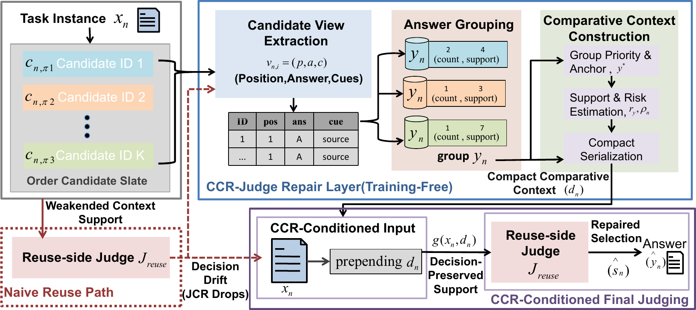

# CCR-Judge

## Cross-Candidate Context Repair for Decision-Preserving LLM Judging under KV-Cache Reuse

CCR-Judge is a training-free inference-time repair framework for final-stage LLM judging under KV-cache reuse.

The project studies judge-side KV-cache reuse as a **decision-preservation** problem. Dense-prefill judging is treated as the behavioral reference, and the goal is to preserve its candidate-level selection behavior after introducing KV-cache reuse.

CCR-Judge builds a compact cross-candidate comparative context before final reuse-side judging while keeping the original candidate texts, candidate order, judge backbone, and KV-reuse mechanism unchanged.

---

## Framework

<p align="center">
  
</p>

## Method

CCR-Judge performs:

1. candidate-view extraction;
2. answer grouping;
3. group-support summarization;
4. structural-anchor selection;
5. risk-state estimation;
6. comparative-context construction;
7. CCR-conditioned final judging.

The comparative context contains answer-group support, a structural anchor, major competing groups, and a risk-aware evidence shortlist.

The shortlist controls which evidence is described in greater detail but never removes candidates from the final candidate set.

If the CCR-conditioned output cannot be mapped to a valid candidate ID, the implementation can fall back to the cached base-reuse selection.

---

## Metric

The primary decision-preservation metric is **Judge Consistency Rate (JCR)**:

\[\mathrm{JCR}=
\frac{
\sum_n \eta_n \mathbf{1}[\hat{s}_n=s_n^{\mathrm{dense}}]
}{
\sum_n \eta_n
}.
\]

JCR measures whether the evaluated inference path selects the same canonical candidate as the dense-prefill judge.

It complements task accuracy, since two methods may achieve similar correctness while selecting different candidate solutions.

---

## Repository Structure

```text
CCR-Judge/
├── KVCOMM/            # Multi-agent and KV-cache reuse implementation
├── experiments/       # Experiment and evaluation scripts
├── dataset_adapters/  # Dataset interfaces
├── paper_repair/      # Fixed-slate judge-side evaluation
├── ablation_study/    # CCR ablations
├── assets/            # Framework figures
├── requirements.txt
└── README.md
```

Representative scripts:

```text
experiments/evaluate_mmlu_ori_protocol.py
experiments/evaluate_paper_repair_judge.py
experiments/build_mmlu_paper_repair_candidates.py
experiments/build_gsm8k_paper_repair_candidates.py
experiments/build_humaneval_paper_repair_candidates.py
experiments/benchmark_TTFT.py
```

---

## Installation

```bash
git clone https://github.com/Guangzhou66/CCR-Judge.git
cd CCR-Judge
pip install -r requirements.txt
```

A CUDA-capable PyTorch environment is recommended for local LLM inference.

Model checkpoints are not included in this repository.

---

## Datasets

The experiments cover:

- MMLU
- GSM8K
- HumanEval
- OpenBookQA
- OpenBookQA-Fact

Large benchmark files are not redistributed and should be obtained from their original sources.

Dataset paths may need to be configured according to the corresponding adapter or experiment script.

---

## Usage

Check the available arguments before running an experiment:

```bash
python experiments/evaluate_mmlu_ori_protocol.py --help
```

The repository supports:

- Dense Prefill
- Naive Reuse
- KVCOMM
- CCR-Judge
- fixed-slate judge evaluation
- shuffled and non-shuffled candidate orders
- component ablations
- task accuracy
- JCR
- TTFT diagnostics

For full experiments, configure the required model checkpoint and dataset paths first.

---

## Reproducibility

For strict reproduction, record:

```text
Python version
CUDA version
PyTorch version
Transformers version
model checkpoint
dataset version
random seed
candidate-order setting
experiment command
```

The repository does not include:

```text
model checkpoints
large downloaded datasets
runtime caches
generated experiment outputs
private credentials
```

Some defaults may reflect the original experimental environment and should be adapted when running on another machine.

---

## Static Check

```bash
PYTHONDONTWRITEBYTECODE=1 python -m py_compile \
$(find KVCOMM experiments dataset_adapters paper_repair ablation_study \
-name '*.py' -not -path '*/__pycache__/*')
```

This checks Python syntax only and does not verify datasets, models, CUDA compatibility, or full numerical reproduction.

---

## Citation

```bibtex
@article{chen2026ccrjudge,
  title  = {CCR-Judge: Cross-Candidate Context Repair for Decision-Preserving LLM Judging under KV-Cache Reuse},
  author = {Chen, Peiyu and Chen, Xiaoyu and Fan, Lingyun and Zhao, Ruoxi and Zhao, Yaru and Li, Binyang},
  year   = {2026}
}
```

Please update the final venue and publication metadata after publication.

---

## Code Availability

The implementation and experimental scripts associated with CCR-Judge are provided in this repository.

Model checkpoints and benchmark datasets should be obtained from their original sources.

---

## Contact

For questions regarding the implementation or experimental setup, please contact the authors using the information provided in the paper.
